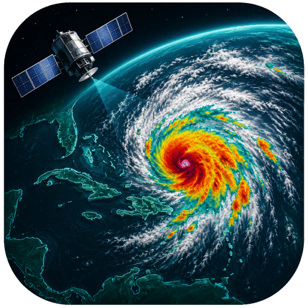

<div align="center">
    
    <h1>Satellite Weather Loop — Trinidad &amp; Tobago</h1>
    <p><em>A self-hosted, always-on animated loop of GOES-19 satellite imagery over Trinidad &amp; Tobago</em></p>
</div>

[](screenshots/grid_view.png)

---

## Why does this exist?

NOAA publishes gorgeous GOES-19 satellite imagery of the Caribbean and tropical Atlantic, refreshed every ten minutes — but it's scattered across a web portal, one band and one still frame at a time. There's no single place to sit and watch the weather *move* over your own slice of the map.

So this builds one. It runs on a Raspberry Pi, quietly downloads each new frame across several spectral bands around the clock, crops them to the Trinidad &amp; Tobago region, and serves a smooth, looping four-panel dashboard you can leave running on a wall display or pull up in any browser on your network. It automatically switches its panel layout between day and night, keeps up to 48 hours of history you can scrub through, and lets you blow any panel up to full screen.

Everything is stored as plain image files you own — no cloud, no account, no database.

---

## Features

- **Four-panel live grid** — GeoColor, water-vapor, clean longwave IR, and Sandwich RGB side by side, all animating in lockstep
- **Smooth looping playback** — play/pause, a scrubber to seek any moment, reset, and selectable speeds (10 / 5 / 1 fps, or **Auto** which matches speed to the time window)
- **Day / night auto-switching** — a sun calculator for Trinidad &amp; Tobago swaps the panel layout at sunrise/sunset so you always see the most useful bands for the current lighting
- **Cycling panel** — the top-right cell rotates through the water-vapor bands (upper / mid / lower level) so you get more bands than there are panels
- **Selectable history** — last 2, 6, 12, 24, or 48 hours, scrubbable frame-by-frame
- **Three zoom levels** — Close (Trinidad &amp; Tobago), Medium (regional), and Wide (Atlantic) crops, switchable on the fly while playback continues from the same moment
- **Full-screen view** — click any panel to enlarge it to full resolution with its own controls and scrubber; click the image to drop back to the grid
- **Time-aligned panels** — every panel is indexed to a shared master timeline, so all four always show the *same* timestamp even when a band (e.g. daytime-only visible) has gaps
- **Real-time updates** — the server pushes a notification (Server-Sent Events) the moment a new frame finishes processing, so the loop extends itself without a manual refresh
- **Automatic backfill** — on startup it fetches the recent history it's missing, and a manual tool can pull more when available
- **Self-managing storage** — old frames are pruned automatically to stay within configurable disk limits; lightweight thumbnails are generated for the grid so the Pi isn't decoding full-resolution frames four at a time
- **Resilient downloading** — retries, frame tracking, and missing-frame recovery handle NOAA's occasional gaps and your network's hiccups

---

## The two views

[](screenshots/enlarged_view.png)
<p align="center"><em>Enlarged view — any panel blown up to full resolution with its own scrubber and controls</em></p>

The **grid** (top of this page) is the main view: four bands at once, animating together. Click any panel — or its ⛶ icon — to open the **enlarged view** above, which shows that single band at full resolution and keeps playing from wherever the grid was. Click the image, hit the ✕, or press `Esc` to return.

---

## How it works

```
NOAA GOES-19 CDN  ──►  downloader  ──►  raw frames (7200×4320)
                                            │
                                            ▼
                                        processor  ──►  cropped 1920×1080 frames  (per zoom level)
                                            │                + 960×540 grid thumbnails
                                            ▼
                                     images/ on disk
                                            │
   browser  ◄──  Flask app  ◄──  storage manager (time-aligned lists, cleanup)
      ▲             │
      └─ SSE push ◄─┘  (new-frame notifications)
```

- **`image_downloader.py`** — fetches each new 10-minute frame for every band from NOAA's public CDN, with retries and frame tracking.
- **`image_processor.py`** — crops each raw frame to the three zoom regions, writes a full-resolution `1920×1080` JPEG plus a `960×540` grid thumbnail.
- **`storage_manager.py`** — lists available frames aligned to a shared timeline, and prunes old ones to stay within disk limits.
- **`sun_calculator.py`** — computes sunrise/sunset for Trinidad &amp; Tobago to drive day/night mode.
- **`app.py`** — the Flask server: serves the dashboard, the image/grid APIs, and the SSE stream.
- **`static/js/*`** — the vanilla-JS frontend: loop engine, grid manager, full-screen viewer, scrubber, and controls.

### Grid layout (day vs. night)

| Panel | Day mode | Night mode |
|---|---|---|
| Top-left | GeoColor | GeoColor |
| Top-right *(cycles)* | Sandwich RGB → WV 10 → WV 9 → WV 8 | WV 10 → WV 9 → WV 8 |
| Bottom-left | Band 2 (Red-Visible) | Band 13 (Clean Longwave IR) |
| Bottom-right | Band 13 (Clean Longwave IR) | Sandwich RGB |

> Band 2 (visible) only exists in daylight, which is exactly why the layout switches at night — and why the time-alignment logic carries panels forward across gaps.

### Bands captured

| Band | What it shows | Available |
|---|---|---|
| GeoColor | True-color-style composite | 24h |
| Sandwich RGB | IR + visible blend, highlights convection | 24h |
| Band 2 | Red-Visible (0.64 µm) | Daytime only |
| Band 13 | Clean Longwave IR (10.3 µm) | 24h |
| Band 10 | Lower-level Water Vapor (7.3 µm) | 24h |
| Band 9 | Mid-Level Water Vapor (6.9 µm) | 24h |
| Band 8 | Upper-Level Water Vapor (6.2 µm) | 24h |

Source frames are GOES-19 ABI imagery for the regional sector covering Trinidad &amp; Tobago and the surrounding tropical Atlantic, refreshed every 10 minutes (6 frames/hour), retained for 48 hours.

---

## Requirements

### Raspberry Pi *(recommended for 24/7 operation)*

Running on a Pi is the intended setup — it stays on, keeps the loop current, and serves the dashboard to any device on your network.

| Requirement | Detail |
|---|---|
| Hardware | Raspberry Pi 4 / 5 (or any always-on Linux box) |
| OS | Raspberry Pi OS (Bookworm or later, 64-bit recommended) |
| Python | 3.11+ |
| Network | Always-on internet connection (to reach NOAA's CDN) |
| Storage | A few GB free; 24h of all bands &amp; zooms is on the order of a couple GB. An SD card or external drive works — limits are configurable. |

### Any computer *(macOS, Linux, Windows)*

The app is plain Python + Flask + Pillow and runs anywhere for testing or occasional use.

| Requirement | Detail |
|---|---|
| OS | macOS, Linux, or Windows |
| Python | 3.11+ |

**Python packages** (installed by the deploy script / `requirements.txt`): Flask, flask-cors, Pillow, numpy, requests, astral, pytz, schedule, psutil.

---

## Installation

### Raspberry Pi (recommended)

The deploy script handles the virtual environment, dependencies, and directory layout — and is written to tolerate SD-card/external-storage filesystems that don't support symlinks.

```bash
cd ~/satellite_weather_imager
./deploy_pi_fixed.sh
```

This creates a `venv/`, installs requirements, builds the `images/` and `logs/` folders, and writes a `start_app.sh` launcher.

### Any other computer

```bash
cd satellite_weather_imager
python3 -m venv venv
source venv/bin/activate
pip install -U pip
pip install -r requirements.txt
python3 app.py
```

---

## Running it

```bash
./start_app.sh            # or: source venv/bin/activate && python3 app.py
```

Then open the dashboard:

- On the Pi: <http://localhost:5000>
- From any device on your network: `http://<pi-ip-address>:5000`

On first start the images directory will be empty; the app immediately begins backfilling the recent past and downloading new frames every 10 minutes. Give it a few minutes to populate.

To keep it running 24/7 across reboots, run it under `systemd` (a service unit is straightforward to add — point `ExecStart` at your venv's Python and `app.py`).

> **Tip:** static assets are cache-busted on every server start, so after you restart the app a normal browser reload always picks up the latest version.

---

## Using the dashboard

| Control | What it does |
|---|---|
| **Play / Pause** | Start or stop the loop (`Space` also toggles) |
| **Scrubber** | Drag to seek to any frame; playback resumes where you leave it |
| **Reset** | Jump back to the first frame |
| **FPS — 10 / 5 / 1** | Playback speed; **Auto** matches speed to the time window |
| **Time Period** | 2 / 6 / 12 / 24 / 48 hours of history |
| **Zoom — Close / Medium / Wide** | Switch crop region; the loop keeps playing from the same moment |
| **Click a panel / ⛶** | Open the enlarged full-resolution view |
| **Click image / ✕ / `Esc`** | Return to the grid |

The status bar shows the current local time, day/night mode, the next sunrise/sunset countdown, the frame timestamp, and when the data last updated.

---

## Backfilling history

On startup the app automatically fetches the recent frames it's missing. To pull a deeper history (e.g. after wiping the images folder), use the manual tool:

```bash
# preview what's recoverable without downloading
python3 manual_smart_startup.py --analyze-only --hours 48

# fetch and process the last 24 hours
python3 manual_smart_startup.py --hours 24 --with-processing
```

> **NOAA retention caveat:** frames are fetched by their exact public URL, and NOAA's CDN only keeps a rolling window of recent imagery. Requests for frames older than that window simply 404 and are skipped — so `--hours 48` will recover only as much as NOAA still hosts. Run `--analyze-only` first to see what's actually available.

---

## Configuration

Most knobs live in **`config.py`**:

| Setting | Default | Meaning |
|---|---|---|
| `IMAGE_SETTINGS['update_interval_seconds']` | `600` | How often new frames are fetched (10 min) |
| `IMAGE_SETTINGS['retention_hours']` | `48` | How long frames are kept |
| `IMAGE_SETTINGS['compression_quality']` | `85` | Full-image JPEG quality |
| `GRID_THUMBNAIL_CONFIG` | `960×540`, q80 | Downscaled grid thumbnail size/quality |
| `CROP_SETTINGS` | — | Pixel crop boxes for Close / Medium / Wide zooms |
| `STORAGE_CONFIG` | 50 GB cap | Disk limits and cleanup thresholds |
| `FPS_CONFIG` | 10 / 5 / 1 | Playback speeds and per-period defaults |
| `TRINIDAD_LOCATION` | 10.69, -61.22 | Lat/long/timezone for the sun calculator |
| `FLASK_CONFIG['PORT']` | `5000` | Web server port |
| `DOWNLOAD_CONFIG['user_agent']` | *(this project)* | The identity sent to NOAA — update the URL to your repo |

Logs are written to **`logs/`** (rotating, INFO level). To re-enable verbose per-frame logging in the browser console, set `window.APP_DEBUG = true` in `templates/index.html`.

---

## Maintenance tools

These standalone scripts live in the project root (run them with the venv active):

| Script | Purpose |
|---|---|
| `manual_smart_startup.py` | On-demand backfill of missing frames |
| `frame_recovery_tool.py` | Retry frames previously marked missing |
| `frame_status_checker.py` | Report which frames exist vs. expected |
| `cleanup_unprocessed_images.py` | Process any raw frames that never got cropped |
| `satellite_update_monitor.py` | Watch NOAA's publish cadence (diagnostics) |

---

## HTTP API

| Endpoint | Returns |
|---|---|
| `GET /` | The dashboard |
| `GET /api/grid-images/<hours>/<zoom>` | Time-aligned frame lists for all bands |
| `GET /api/images/<band>/<zoom>/<hours>` | Frame list for one band |
| `GET /api/sun-status` | Day/night status and next sunrise/sunset |
| `GET /api/system-status` | Storage, processor, uptime, missing-frame stats |
| `GET /api/config` | Client configuration (bands, periods, zooms, fps) |
| `GET /api/stream` | Server-Sent Events stream of new-frame notifications |
| `GET /images/<path>` | Processed images (with ETag/caching) |
| `GET /health` | Health check |

---

## Notes

- **Storage:** designed to run from an SD card or external drive. Logs rotate, old frames are pruned automatically, and the grid is served from small thumbnails so the Pi isn't decoding four 1080p frames per tick.
- **Performance:** the frontend uses a single shared image cache, preloads ahead of playback, and pushes updates over SSE rather than polling — so it stays smooth even on modest hardware.
- **Time zone:** files store UTC timestamps; the UI displays Trinidad &amp; Tobago local time (UTC-4).

---

## Data source &amp; attribution

Imagery is **GOES-19 (NOAA/NESDIS)** data, retrieved from NOAA's public STAR imagery CDN. NOAA satellite imagery is a work of the U.S. federal government and is in the **public domain**.

This project downloads each frame once and re-serves it locally, so the load on NOAA's servers is the same whether one person or a hundred are watching. Please be a considerate user if you adapt this: keep the 10-minute fetch interval (don't hammer the CDN), keep concurrency modest, and use an honest, identifying `User-Agent` (set yours in `config.py`).

> **This project is not affiliated with, endorsed by, or connected to NOAA, NESDIS, or any government agency.**

---

## Disclaimer

This is an independent, personal project provided for educational and personal use. It only **reads** publicly available imagery — it controls nothing and stores no personal data. It depends on NOAA's URL scheme and CDN retention, which can change without notice and may break downloads at any time. No warranty is provided; use at your own risk.

**Not for operational or safety-of-life decisions.** For official forecasts, watches, and warnings, always consult your national meteorological service.
</content>
